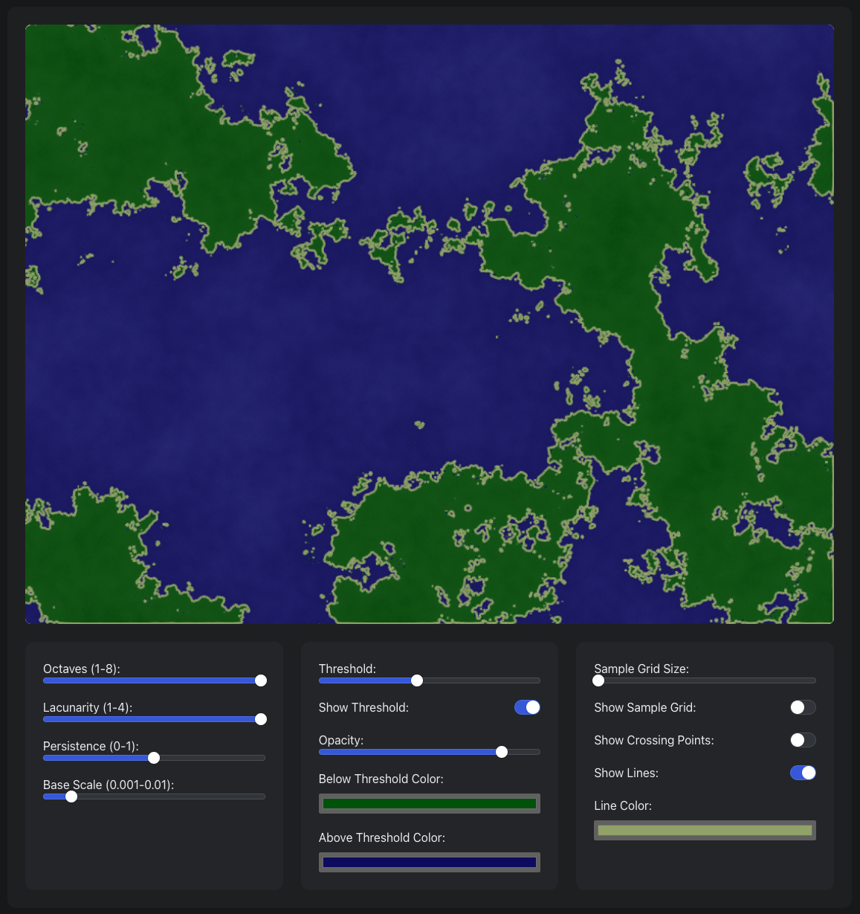

# Marching Squares Visualizer

An interactive visualization of the marching squares algorithm with fractal noise.



## Features

- Real-time fractal noise generation using simplex noise
- Interactive marching squares visualization
- Adjustable parameters:
  - Noise: octaves, lacunarity, persistence, base scale
  - Threshold controls with color customization
  - Grid size and visualization options

## Running Locally

```bash
npm install
npm run dev
```

## Implementation

- Built with React + TypeScript + Vite
- Uses simplex-noise for noise generation
- Canvas-based rendering
- Radix UI components for controls